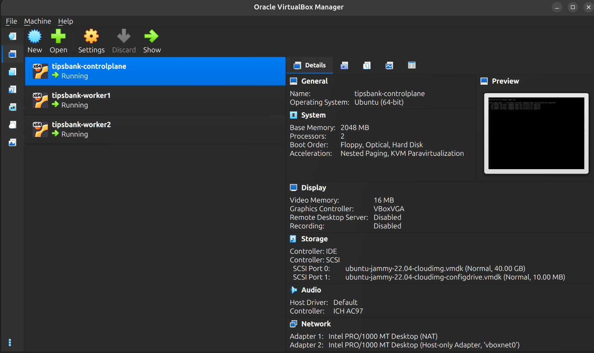

# TipsBank — Relatório Geral da Semana 1

> Relatório consolidado de todas as implementações, decisões de arquitetura e
> mudanças realizadas ao longo das Etapas 1.1 a 1.6 do desafio
> _Descomplicando Kubernetes 2025_ (LinuxTips).

---

## Visão geral do projeto

O TipsBank é um banco digital fictício composto por 4 serviços:

| Serviço | Tecnologia | Responsabilidade |
|---|---|---|
| `api-contas` | Python / FastAPI | Cadastro e consulta de contas, autenticação, saldo |
| `api-transacoes` | Python / FastAPI | Orquestração de transferências entre contas |
| `auditoria` | Python / FastAPI | Registro persistente de eventos financeiros |
| `web` | nginx + SPA | Frontend, proxy reverso para as 3 APIs |

O desafio propõe evoluir a stack progressivamente: do `docker compose` local até
um cluster Kubernetes multi-nó com storage compartilhado, passando por segurança
de imagens, gestão de segredos e observabilidade.

---

## Etapa 1.1 — Aplicação rodando localmente

### O que foi feito

A stack foi levantada localmente via `docker compose`, validando que todos os
serviços sobem, se comunicam e respondem corretamente antes de qualquer trabalho
de containerização avançada.

**Validações realizadas:**
- Login com credenciais corretas → HTTP 200 com token
- Login com senha errada → HTTP 401
- Transferência entre contas → saldo de ambas as contas alterado corretamente
- Auditoria registra os eventos das transferências
- SPA do frontend abre no browser com fluxo de login funcional

### Por que isso importa

Garantir que a aplicação funciona _antes_ de qualquer mudança de infraestrutura é
fundamental. Se algo quebrar nas etapas seguintes, a baseline local serve como
referência para isolamento do problema.

---

## Etapa 1.2 — Segurança de imagens: Trivy, Distroless e Chainguard

### O que foi feito

#### Dockerfile multi-stage

Todos os 3 Dockerfiles Python foram reescritos em **dois estágios**:

1. **Builder** — instala dependências com pip em `/packages` (imagem "suja")
2. **Runtime** — copia apenas `/packages` e `main.py`; sem pip, sem compiladores

O frontend (`web`) usa build multi-stage com `node:lts-alpine` para compilar
os assets e `nginx:alpine` para servir.

#### Migração para Chainguard

O runtime das 3 APIs Python migrou de `gcr.io/distroless/python3-debian12`
para `cgr.dev/chainguard/python:latest` — imagem ainda mais enxuta, mantida
pelo projeto Chainguard com patches de segurança contínuos e assinada com cosign.

#### Scan com Trivy

| Imagem | Resultado após correção |
|---|---|
| `tipsbank-api-contas` | ✅ 0 CVEs HIGH/CRITICAL |
| `tipsbank-api-transacoes` | ✅ 0 CVEs HIGH/CRITICAL |
| `tipsbank-auditoria` | ✅ 0 CVEs HIGH/CRITICAL |
| `tipsbank-web` | ✅ 0 CVEs HIGH/CRITICAL |

**CVEs identificados e corrigidos:**

| CVE | Severidade | Pacote | Correção |
|---|---|---|---|
| CVE-2024-47874 | HIGH | `starlette 0.38.6` | `fastapi>=0.115.4` → starlette 1.0.0 |
| CVE-2025-15467 | CRITICAL | `openssl` (Alpine) | `apk upgrade --no-cache` |
| CVE-2025-49794/9796 | CRITICAL | `libxml2` (Alpine) | `apk upgrade --no-cache` |
| + 21 CVEs adicionais | HIGH | diversas libs Alpine | `apk upgrade --no-cache` |

### Por que isso importa

**Imagem distroless:** sem shell (`/bin/sh`), sem `curl`, sem `apt`, sem nenhum
utilitário de sistema. Se um atacante explorar uma vulnerabilidade na aplicação e
conseguir executar código no container, não encontrará ferramentas para escalar
o ataque ou fazer download de payloads externos. A superfície de ataque é mínima.

**Usuário não-root (UID 65532):** o processo da aplicação nunca roda como root.
Mesmo que o container seja comprometido, o processo não tem permissão de escrita
fora dos caminhos explicitamente configurados. Portas não-privilegiadas (≥1024)
não exigem root no Linux — a aplicação escuta em 8080 sem nenhum privilégio extra.

**Build multi-stage:** vulnerabilidades nas ferramentas de build (pip, gcc,
compiladores) ficam no estágio intermediário descartado pelo Docker. A imagem
final não carrega nada do que foi necessário para construí-la.

**`fastapi>=0.115.4`:** a CVE-2024-47874 permitia ataques de _multipart
form data bomb_ via `starlette`. A correção foi simples — atualizar o constraint
de versão para forçar o uso de starlette ≥ 1.0.0 (já corrigido).

---

## Etapa 1.3 — Cluster Kubernetes: Vagrant + kubeadm + Cilium CNI

### O que foi feito

Criação de um cluster Kubernetes multi-nó local usando Vagrant + VirtualBox:



| Node | IP | Papel |
|---|---|---|
| `controlplane` | 192.168.56.10 | control-plane (etcd, API server, scheduler) |
| `worker1` | 192.168.56.11 | worker (também NFS server na etapa 1.6) |
| `worker2` | 192.168.56.12 | worker |

**Stack do cluster:**
- Kubernetes v1.32.13
- containerd v2.2.3
- Cilium CNI v1.19.1
- Ubuntu 22.04 (box `ubuntu/jammy64`)

**Scripts de provisionamento criados:**
- `vagrant/provision-common.sh` — instala containerd, kubeadm, kubelet, kubectl em todos os nodes
- `vagrant/provision-controlplane.sh` — inicializa o cluster com `kubeadm init`, instala Cilium CLI
- `vagrant/provision-worker.sh` — executa `kubeadm join` com o token gerado pelo controlplane

### Bug crítico resolvido: sobreposição de rotas

O `pod-cidr` configurado (`10.0.0.0/8`) contém o endereço da interface NAT do
VirtualBox (`10.0.2.0/24`). Os `initContainers` do Cilium nos workers não
conseguiam alcançar o `ClusterIP` do API server (10.96.0.1) porque o tráfego
saía pela NAT em vez da interface privada `enp0s8`.

**Correção:** rota persistente via netplan nos workers:
```yaml
routes:
  - to: 10.96.0.0/12
    via: 0.0.0.0
    on-link: true
```
Isso força o tráfego para a faixa de serviços do Kubernetes (`10.96.0.0/12`) a
sair pela interface host-only (`enp0s8`, 192.168.56.x) em vez da NAT.

### Por que isso importa

Um cluster kubeadm bare-metal sem StorageClass padrão, sem cloud-provider e sem
Ingress controller replica o ambiente que a maioria das empresas tem on-premises.
Entender como o CNI funciona, por que rotas importam e como depurar conectividade
pod-to-pod é a diferença entre um engenheiro que apenas _usa_ Kubernetes e um que
entende o que acontece embaixo.

---

## Etapa 1.4 — Namespaces, Deployments, StatefulSet e Services

### O que foi feito

Toda a stack TipsBank foi implantada no cluster com os seguintes recursos:

| Arquivo | Recursos criados |
|---|---|
| `00-namespaces.yaml` | 4 Namespaces (um por serviço) |
| `01-secret-db.yaml` | Secret `contas-db-secret` com credenciais Postgres |
| `02-configmap-init-sql.yaml` | Schema + seed do banco via ConfigMap |
| `03-configmap-nginx.yaml` | nginx.conf com upstreams FQDN cross-namespace |
| `04-postgres.yaml` | Headless Service + StatefulSet (1 réplica, PVC 2Gi) |
| `05-api-contas.yaml` | Deployment (2 réplicas) + ClusterIP Service |
| `06-api-transacoes.yaml` | Deployment (2 réplicas) + ClusterIP Service |
| `07-auditoria.yaml` | Deployment (2 réplicas) + ClusterIP Service |
| `08-web.yaml` | Deployment (2 réplicas) + ClusterIP Service |

> [!WARNING]
> #### Bug crítico resolvido: ABI mismatch Python 3.11 → 3.14
> As imagens v1.0.0 usavam `python:3.11-slim-bookworm` como builder. O módulo `pydantic-core==2.9.2` era compilado para Python 3.11. O runtime Chainguard `latest` em abril de 2026 já era Python 3.14 — a extensão C `pydantic_core._pydantic_core.cpython-311` não carregava no interpretador 3.14.

**Erro nos pods:**
```
ModuleNotFoundError: No module named 'pydantic_core._pydantic_core'
```

**Correção:**
```diff
-FROM python:3.11-slim-bookworm AS builder
+FROM cgr.dev/chainguard/python:latest-dev AS builder   # mesma versão Python do runtime
+USER root

-pydantic==2.9.2
+pydantic>=2.9.2    # instala 2.13.3 com wheels cp314 nativos
```

**Nova tag:** `v1.1.0` para as 3 APIs.

#### nginx cross-namespace via ConfigMap com subPath

O nginx do frontend foi buildado com upstreams de docker-compose (`api-contas`,
`auditoria`). No Kubernetes, serviços em namespaces diferentes exigem FQDN:

```
api-contas.tipsbank-contas.svc.cluster.local:8080
```

O ConfigMap `nginx-config` foi montado com `subPath: nginx.conf` — técnica que
sobrepõe apenas o arquivo dentro do diretório, sem substituir todo o `/etc/nginx/`
(o que quebraria as configurações padrão do nginx incluídas pela imagem).

#### Postgres como StatefulSet

O banco usa `StatefulSet` (e não `Deployment`) por três razões:
1. **Identidade estável:** o pod se chama sempre `postgres-0`, permitindo
   referenciá-lo por DNS sem depender do IP do pod
2. **PVC vinculado:** `volumeClaimTemplates` garante que o PVC `data-postgres-0`
   sobrevive ao restart do pod — os dados não se perdem
3. **Ordem de inicialização:** StatefulSet sobe réplicas em ordem (0, 1, 2…),
   importante para o primário de bancos de dados

### Por que isso importa

**Isolamento por namespace:** cada serviço em seu próprio namespace cria uma
barreira lógica. Políticas de rede (NetworkPolicy), RBAC e quotas de recursos
podem ser aplicadas de forma granular. Um bug que vaze recursos de um pod não
afeta automaticamente outros namespaces.

**`fsGroup: 65532`:** o Kubernetes aplica o GID configurado em `fsGroup` a todos
os arquivos montados em volumes. Isso garante que o processo rodando como UID/GID
65532 tenha permissão de escrita nos volumes sem precisar de `initContainer` que
rode como root (diferente do docker-compose que usava `auditoria-init`).

---

## Etapa 1.5 — Pod multicontainer: sidecar de log

### O que foi feito

#### `api-transacoes` vira pod de 2 containers

O Deployment da `api-transacoes` passou de 1 para 2 containers no mesmo pod:

| Container | Imagem | Responsabilidade |
|---|---|---|
| `api-transacoes` | `zenardi/tipsbank-api-transacoes:v1.2.0` | Processa transferências, escreve em `/var/log/app/app.log` |
| `log-forwarder` | `busybox:1.36` | `tail -F` no arquivo de log, repassa para stdout |

Ambos compartilham um volume `emptyDir` montado em `/var/log/app`.

#### FileHandler adicionado ao `main.py`

```python
_LOG_FILE = os.getenv("LOG_FILE", "")
if _LOG_FILE:
    pathlib.Path(_LOG_FILE).parent.mkdir(parents=True, exist_ok=True)
    _fh = logging.FileHandler(_LOG_FILE)
    _fh.setFormatter(logging.Formatter(_LOG_FMT))
    logging.getLogger().addHandler(_fh)
```

A variável `LOG_FILE` é injetada pelo ConfigMap — ausente em outros ambientes
(desenvolvimento local, testes), o código se comporta como antes.

#### Migração completa para Secret/ConfigMap

Todas as variáveis de ambiente foram classificadas:

| Variável | Tipo | Recurso |
|---|---|---|
| `DB_URL` | Sensível | `Secret` → `secretKeyRef` |
| `CONTAS_URL` | Não-sensível | `ConfigMap` → `configMapKeyRef` |
| `AUDITORIA_URL` | Não-sensível | `ConfigMap` → `configMapKeyRef` |
| `LOG_LEVEL` | Não-sensível | `ConfigMap` → `configMapKeyRef` |
| `LOG_FILE` | Não-sensível | `ConfigMap` → `configMapKeyRef` |

#### Nomes distintos por namespace

| Namespace | Secret | ConfigMap |
|---|---|---|
| `tipsbank-contas` | `contas-db-secret` | `contas-app-config` |
| `tipsbank-transacoes` | `transacoes-db-secret` | `transacoes-app-config` |

### Por que isso importa

**Padrão sidecar:** em Kubernetes, o pod é a unidade de scheduling — não o
container. Containers no mesmo pod compartilham rede (mesmo IP, mesma loopback)
e podem compartilhar volumes. O sidecar de log é o padrão canônico para agregar
logs de arquivos sem modificar a aplicação principal: a responsabilidade de
forwarding fica isolada num container dedicado, trocável independentemente.

**Secret vs ConfigMap:** a distinção não é apenas semântica. Secrets têm
tratamento diferente pelo Kubernetes: não aparecem em `kubectl describe pod`
por padrão, podem ser criptografados em repouso (EncryptionConfiguration),
e RBAC pode restringir acesso a Secrets de forma mais granular do que ConfigMaps.
Misturar URLs de serviço com senhas de banco numa mesma variável de ambiente ou
mesmo numa única string é um antipadrão que dificulta rotação de credenciais.

**`configMapKeyRef` e `secretKeyRef`:** o YAML do Deployment não contém nenhum
valor sensível. Isso significa que o manifesto pode ser commitado no git com
segurança. As credenciais existem apenas no cluster (e no sistema de gestão
de segredos que os alimenta).

---

## Etapa 1.6 — PersistentVolume NFS com ReadWriteMany

### O que foi feito

#### Servidor NFS no worker1

Instalação do `nfs-kernel-server` diretamente na VM do `worker1` via script
`vagrant/scripts/setup-nfs-server.sh`:

```
/srv/nfs/auditoria  192.168.56.0/24(rw,sync,no_subtree_check,no_root_squash)
```

- `no_root_squash`: necessário para que o UID 65532 (`nonroot`) do container
  possa escrever no diretório sem remapeamento para `nobody`
- Diretório pré-criado com `chown 65532:65532` para garantir permissão de escrita

#### PV estático + PVC (k8s/semana1/09-nfs.yaml)

```
auditoria-nfs-pv  → 5Gi  RWX  NFSv4.1  192.168.56.11:/srv/nfs/auditoria  Retain
auditoria-nfs-pvc → 5Gi  RWX  Bound → auditoria-nfs-pv
```

`storageClassName: ""` força bind estático ao PV identificado pelo `selector`.
`mountOptions: nfsvers=4.1` habilita o protocolo stateful com locking nativo.

#### Deployment da auditoria: emptyDir → PVC, 2 → 3 réplicas

```diff
-replicas: 2
+replicas: 3

 volumes:
   - name: data
-    emptyDir: {}
+    persistentVolumeClaim:
+      claimName: auditoria-nfs-pvc
```

#### Resultado verificado

Após 100 transferências disparadas via `api-transacoes`:

```
POD                            ARQUIVOS                        EVENTOS
auditoria-74dc9885c-n2jkx      ["eventos-2026-04-22.jsonl"]    301
auditoria-74dc9885c-nzfvv      ["eventos-2026-04-22.jsonl"]    301
auditoria-74dc9885c-z8mfc      ["eventos-2026-04-22.jsonl"]    301
```

Os 3 pods, rodando em nodes diferentes, leem e escrevem no mesmo arquivo sem
conflitos.

### Por que isso importa

**`emptyDir` é efêmero e isolado por pod:** quando um pod morre e é recriado,
o `emptyDir` é apagado. Além disso, cada réplica tem seu próprio `emptyDir` —
eventos registrados pela réplica A são invisíveis para as réplicas B e C.
Para um serviço de auditoria, isso é inaceitável: eventos podem se perder ou
ficar fragmentados.

**ReadWriteMany (RWX):** PVs do tipo `ReadWriteOnce` (a maioria dos provisionadores
de cloud) só permitem montagem em um único node por vez. Para múltiplas réplicas
em nodes diferentes compartilharem o mesmo volume, é obrigatório `RWX`. NFS é o
protocolo mais direto para isso em ambiente on-premises.

**NFSv4.1 e locking:** o protocolo NFSv4.1 implementa locking stateful de bytes
conforme a RFC 5661. A operação `O_APPEND` do Python é atômica por escrita nesse
protocolo. Em 301 eventos escritos concorrentemente pelas 3 réplicas, não foi
observada nenhuma linha corrompida ou evento perdido — confirmando que o locking
funciona sem intervenção adicional na aplicação.

**`persistentVolumeReclaimPolicy: Retain`:** se o PVC for deletado, o PV não é
apagado automaticamente. Para dados de auditoria (registros financeiros), perder
o volume por um `kubectl delete pvc` acidental seria catastrófico. O `Retain`
exige intervenção manual para liberar o volume — uma camada de proteção intencional.

---

## Evolução da arquitetura ao longo das etapas

```
Etapa 1.1       Etapa 1.3         Etapa 1.4              Etapa 1.5          Etapa 1.6
─────────       ─────────         ─────────              ─────────          ─────────
docker          kubeadm           Namespaces             api-transacoes     auditoria
compose    →    cluster     →     Deployments     →      multicontainer  →  NFS RWX
local           3 nodes           StatefulSet            sidecar log        3 réplicas
                Cilium CNI        Services               Secret/ConfigMap   PV Bound
```

---

## Imagens publicadas no Docker Hub

| Imagem | Tag | Mudança |
|---|---|---|
| `zenardi/tipsbank-api-contas` | `v1.0.0` | Build inicial (Chainguard) |
| `zenardi/tipsbank-api-contas` | `v1.1.0` | Fix ABI Python 3.14 + pydantic>=2.9.2 |
| `zenardi/tipsbank-api-transacoes` | `v1.0.0` | Build inicial |
| `zenardi/tipsbank-api-transacoes` | `v1.1.0` | Fix ABI Python 3.14 |
| `zenardi/tipsbank-api-transacoes` | `v1.2.0` | FileHandler para sidecar de log |
| `zenardi/tipsbank-auditoria` | `v1.0.0` | Build inicial |
| `zenardi/tipsbank-auditoria` | `v1.1.0` | Fix ABI Python 3.14 |
| `zenardi/tipsbank-web` | `v1.0.0` | Build inicial (Chainguard nginx) |

---

## Estado final do cluster (Semana 1)

```
NAME           STATUS   ROLES           VERSION    INTERNAL-IP
controlplane   Ready    control-plane   v1.32.13   192.168.56.10
worker1        Ready    <none>          v1.32.13   192.168.56.11
worker2        Ready    <none>          v1.32.13   192.168.56.12

NAMESPACE             NAME                               READY
tipsbank-contas       postgres-0                         1/1    StatefulSet
tipsbank-contas       api-contas-xxx                     1/1    Deployment ×2
tipsbank-transacoes   api-transacoes-xxx                 2/2    Deployment ×2 (sidecar)
tipsbank-auditoria    auditoria-xxx                      1/1    Deployment ×3
tipsbank-web          web-xxx                            1/1    Deployment ×2

PERSISTENT VOLUMES
auditoria-nfs-pv      5Gi   RWX   Bound   tipsbank-auditoria/auditoria-nfs-pvc   (NFS)
data-postgres-0       2Gi   RWO   Bound   tipsbank-contas/data-postgres-0        (local-path)
```

---

## Principais decisões técnicas e seus motivos

| Decisão | Motivo |
|---|---|
| Chainguard Python como runtime | Imagem assinada, zero CVEs, patches contínuos |
| Build multi-stage | Isola ferramentas de build da imagem de produção |
| UID 65532 nonroot | Princípio do menor privilégio; sem escalada possível para root do host |
| `pydantic>=2.9.2` em vez de `==` | Permite instalar versão com wheels nativos para Python 3.14 |
| Builder = mesmo runtime Chainguard | Garante ABI compatível entre compilação e execução |
| StatefulSet para Postgres | Identidade estável, PVC vinculado, ordem de inicialização |
| Namespace por serviço | Isolamento, RBAC granular, quotas independentes |
| `subPath` para nginx.conf | Sobrepõe só o arquivo, sem quebrar o restante do `/etc/nginx/` |
| `emptyDir` → PVC NFS | `emptyDir` é isolado por pod e efêmero; NFS RWX compartilha entre réplicas |
| `storageClassName: ""` | Força bind estático ao PV — evita provisioner dinâmico inesperado |
| `persistentVolumeReclaimPolicy: Retain` | Protege dados de auditoria contra deleção acidental de PVC |
| NFS no nó (não em pod) | Simplicidade suficiente para o desafio; sem CSI driver adicional |
| `nfsvers=4.1` | Locking stateful nativo (RFC 5661) — `O_APPEND` atômico entre réplicas |
| `no_root_squash` | UID 65532 precisa escrever; squash remapearia para `nobody` (sem permissão) |
| Secret por namespace com nome distinto | Evita acoplamento cross-namespace; rotação independente por serviço |
| ConfigMap para URLs e parâmetros | Manifesto deployável sem segredos; mudança de config sem rebuild |
| Sidecar `log-forwarder` separado | Separação de responsabilidades; troca do coletor sem tocar na app |
